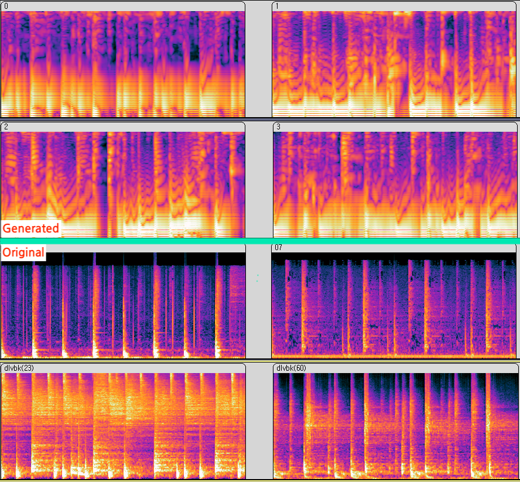

# VAE Drum Loop Generator

A desired image can be generated from random nosise. Which means that a Mel-Spectrogram from the sound can also be generated.  

There have been some studies on voice generation. then what about percussive sound?

</br></br>

## Dataset
---
Since there's no drum dataset at one fixed bpm, **600+** two-bar drum loops were extracted from 70's 80's Funk/Soul music (primarily sampled in hip-hop) and fixed at 88 bpm using **StudioOne** DAW.  

bpm is fixed at 88 due to a mistake, if you collect new dataset, I recommend setting the bpm to 90 or finding a bpm that can hold `hop_length` to a power of 2.  

Due to copyright issues, I can't share my dataset.
Additional modifications are needed, but [E-GMD][gmd_lnk] dataset from **Magenta** would be a good enough substitute.  

[gmd_lnk]: https://magenta.tensorflow.org/datasets/e-gmd "The Expanded Groove MIDI Dataset"

All `*.wav` files are converted into normalized log-spectrograms over `librosa.stft` and `numpy.absolute`.  


</br>


### How to use
```ptyhon
# direct use to generate drum loops
python generate.py # generated audio will be save in './generated'

# train the datat w/ own dataset
python preprocess.py # well-defined dataset be needed in './datastes/audio/'
python train.py
python generate.py
```

</br></br>


## Results
---
### Mel-Spectrogram Comparison
</br>



</br>

### Audio

Beware of terrible noise.


https://user-images.githubusercontent.com/81271890/200157365-5b239bbc-10b5-41ba-8d48-c3e260d57549.mp4


https://user-images.githubusercontent.com/81271890/200157432-9b2e88e0-f2de-47bd-8ab1-faddae6fd3b7.mp4


</br></br>

## Detail
---
### Preprocess
Default Input shape is **(256,256)**; therefore, the value of n_fft and hop_length are changed to 512 and 470.

The MAX and min values of the spectrogram can not be easily specified. Since the **Griffin-Lim** algorithm is used as a method of substituting spectrograms into waveforms, the MAX and min values of the spectrogram are stored in dict form before normalizing them.

</br>

### Train

Simple VAE model consisting of several layers of **Conv / ReLU / BatchNorm** layers is used.  
By changing some values in params.py, the model can be easily modified.

</br>

### Generate
A random number array of latent-dim length is generated. By passing the array through the decoder, the normalized log-spectrogram is generated.  
As mentioned before, it is hard to denormalize the spectrogram.  
Therefore, the MAX and min values of the spectrogram from the dict are randomly selected. Denormalization is performed using the min/MAX values, and then log-spectrogram is converted into a spectrogram using `librosa.db_to_amplitude`.  
Finally, the audio file is generated by applying Griffin-Lim algorithm. 


Due to lack of data, lack of epochs, losses from spectrogram to audio, etc., digital noise, which is difficult to call a drum loop, is generated.

However, you can feel the beat, rhythm, and groove finely among the messy noise.

If sufficient training is achieved w/ much larger amounths of data, and using better way to substitute the spectrogram to audio, drum loops can be generated that can be used as percussive sources even if can not be completely replaced the original loops.

